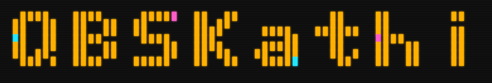

<p align="center">
  
</p>

<p align="center"><b>A programming language for making games entirely out of characters.</b></p>

---

QBSK is one thing, not two: a language and the ASCII engine it was designed around. You do
not import a rendering library and learn its API — the way you describe what is on screen
*is* the language, and the engine is the part of it that draws.

It exists because making an ASCII game usually means fighting a general-purpose language
into a shape it was never meant for. QBSK starts from the shape.

> **On the name.** The language is **QBSK**. The `áthi` on the logo is a private joke with
> myself — it comes from the constructed language of a personal project I build with this
> engine, where `-áthi` is the ending that names a system of writing. Nothing in the
> language, the CLI or the API is called `QBSKáthi`; it is `qbsk` everywhere it matters.

```qbsk
scene Game(width: 80, height: 24, title: "Hello QBSK", fps: 30)

layer frame z: 100
    border (0, 0) to (79, 23) style: double
    text "QBSK" at (36, 10)

layer hero z: 50
    canvas hero_sprite at (10, 5):
        """
         O
        /|\
        / \
        """
```

That is a whole program. `scene` declares the grid, `layer` says what goes on it and in
what order, and everything else — variables, functions, loops, modules, closures — is an
ordinary language underneath.

---

## What it is aiming at

**Intuitive.** The distance between "I want a box there" and the line that puts a box there
should be zero.

**Honest about failure.** An error names the line, the column and the fragment, and says
what to do about it. A construct that quietly does nothing is treated as a defect, not as a
feature that happens to be silent.

**Fast enough to stop thinking about.** The engine composes double-buffered, diffs frames
and emits only what changed.

**Next:** enough performance headroom for fully ASCII 3D.

---

## Where it is

```
 [x]  THE LANGUAGE    lexer, parser, interpreter, closures, modules, CLI
 [x]  THE ENGINE      compositor, double buffer, frame diffing, ANSI truecolor
 [x]  THE STUDIO      desktop editor, WebGL painter, live preview

 [ ]  ASCII 3D        the raycaster and the depth handling are already in the
                      engine. What is left is making them cheap enough to
                      build a real 3D game on, and that is the next stretch.
```

---

## Install

Node 24 or newer.

```bash
git clone https://github.com/9mirx0r/qbsk.git
```

```bash
cd qbsk && npm install && npm run build
```

Run a program:

```bash
node dist/cli/main.js run examples/hello.qbsk
```

With real colour, as an animated loop:

```bash
node dist/cli/main.js run --ansi --loop examples/turns.qbsk --fps 30
```

Check a file without running it:

```bash
node dist/cli/main.js check examples/hello.qbsk
```

`qbsk run`, `check`, `fmt`, `repl`, `lex`, `parse` and `profile` are all there — run the CLI
with no arguments for the list.

## The Studio

A desktop editor with a live preview: type on the left, watch the grid repaint on the
right. It uses a WebGL painter, so a full screen redraws in well under a millisecond.

```bash
npm run studio
```

---

## What is in here

| | |
|---|---|
| `src/` | the language and the engine — lexer, parser, interpreter, natives, compositor, CLI |
| `studio/` | the desktop editor (Electron) |
| `examples/` | **46 runnable programs**, from four lines to a playable first-person demo |
| `docs/` | the specification: `language.md`, `engine.md`, `audio.md`, `studio.md`, and `tour.md` |
| `skills/` | **the manual — read this before writing QBSK** |
| `tests/` | **1,893 tests green across 106 files**, with 26 byte-for-byte golden outputs |
| `bench/` | the performance harness and its recorded baselines |

### `skills/` is not optional reading

QBSK is its own language. There is no Stack Overflow answer, no tutorial series and nothing
on the internet to fall back on when something does not behave the way you expect.

`skills/qbsk-language.md` and `skills/qbsk-engine.md` are the working manual: what the
language actually does, where its limits are, which of them are deliberate, and the mistakes
that have already been made and fixed. They are written densely and on purpose.

**If you work with an AI assistant, give it these two files first.** They were written to be
loaded as skills, and an assistant without them will confidently write QBSK that does not
run — the failure this project has watched happen more than once.

---

## Testing and gates

```bash
npm test
```

`npm run build`, `npm run typecheck`, `npm run lint`, `npm test` and `npm run bench` are the
five checks the project holds itself to.

The suite includes `docs-truth`, which fails when a document claims something the code does
not do — every count and every cited path in this README is verified by it.

The frozen v0.1 surface is **the 51 keywords, the 84 natives** and the scene DSL.
`docs/language.md` §17 says exactly what that promise covers and what it does not.

---

## Licence

MIT. See [LICENSE](LICENSE).

The bundled font is **not** covered by that licence and carries its own — see
[`font/LICENSE.md`](font/LICENSE.md).
